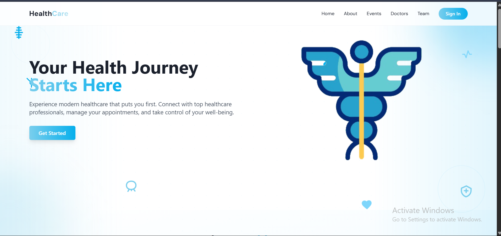

# HealthCB

**A modern healthcare platform connecting patients with care providers**



## Overview

HealthCB is a comprehensive healthcare platform designed to streamline patient-provider interactions through an intuitive digital interface. The application leverages modern web technologies to deliver a seamless user experience while maintaining the highest standards of security and performance.

## Features

- **Secure Authentication System**: Role-based access for patients, doctors, and administrators
- **Interactive Dashboard**: Real-time health data visualization and monitoring
- **Video Consultations**: High-quality video conferencing for remote appointments
- **Messaging System**: Secure chat functionality between patients and healthcare providers
- **Appointment Scheduling**: Intuitive calendar interface for booking and managing appointments
- **Admin Controls**: Comprehensive management tools for healthcare administrators
- **Responsive Design**: Optimized experience across all devices and screen sizes

## Technology Stack

| Front-End                 | Back-End & Infrastructure   |
|---------------------------|----------------------------|
| ⚛️ React 18               | 🔄 Next.js API Routes      |
| 🔷 Next.js 15             | 💾 Prisma ORM              |
| 🎨 TailwindCSS            | 🔒 Authentication API      |
| 🧩 TypeScript             | 📡 RESTful Services        |
| 🌸 DaisyUI Components     | 🗃️ Database Integration    |
| 📊 Interactive Charts     | 🔄 State Management        |
| 📱 Responsive Design      | 🔌 WebSocket Integration   |
| 🎭 Framer Motion          | 📅 Calendar Services       |
| 🎛️ Radix UI Primitives    | 🎥 Twilio Video            |
| 📝 React Hook Form        | 💬 Twilio Conversations    |
| ✅ Zod Validation         | 🔄 API Integration         |

## Project Structure

```
healthcb/
├── app/                  # Next.js app directory (pages, routes)
│   ├── (auth)/           # Authentication routes
│   ├── admin/            # Admin dashboard and features
│   ├── patient/          # Patient portal and features
│   └── api/              # API routes
├── components/           # Reusable UI components
│   ├── ui/               # Core UI components
│   └── Modals/           # Modal components
├── hooks/                # Custom React hooks
├── lib/                  # Utility libraries
├── services/             # External service integrations
├── styles/               # Global styles and theme
├── utils/                # Helper functions
└── public/               # Static assets
```

## Getting Started

```bash
# Install dependencies
npm install

# Run the development server
npm run dev

# Build for production
npm run build

# Start production server
npm start
```

## Key UI/UX Features

- **Intuitive Navigation**: User-friendly interface with clear pathways for different user roles
- **Accessibility Focused**: Designed with WCAG guidelines in mind for inclusive user experience
- **Animated Transitions**: Smooth animations using Framer Motion for enhanced user engagement
- **Consistent Design Language**: Unified component system built with TailwindCSS and DaisyUI
- **Real-time Feedback**: Immediate visual feedback for user interactions
- **Responsive Layouts**: Fluid design that adapts seamlessly to any device

## Future Enhancements

- Enhanced analytics dashboard for healthcare providers
- Integration with wearable health devices
- AI-powered health recommendations
- Expanded telehealth capabilities
- Multi-language support

---

Developed with ❤️ by the HealthCB Team
